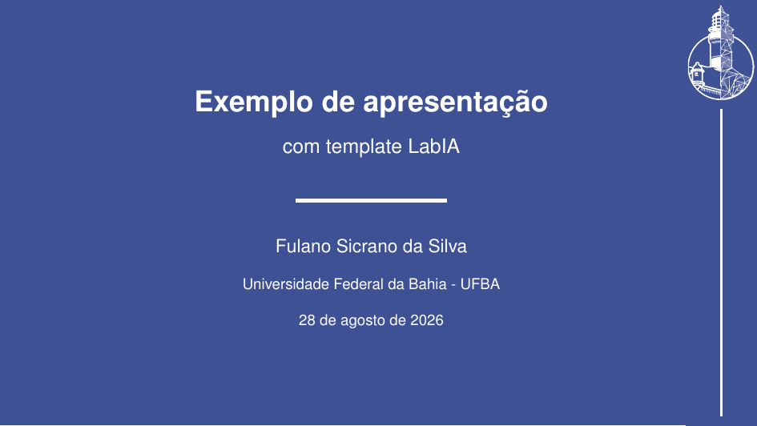
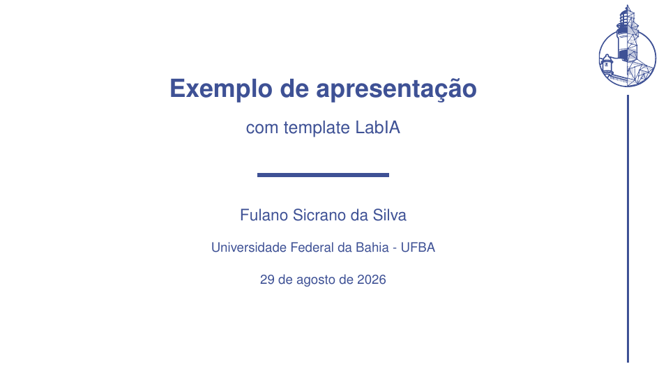
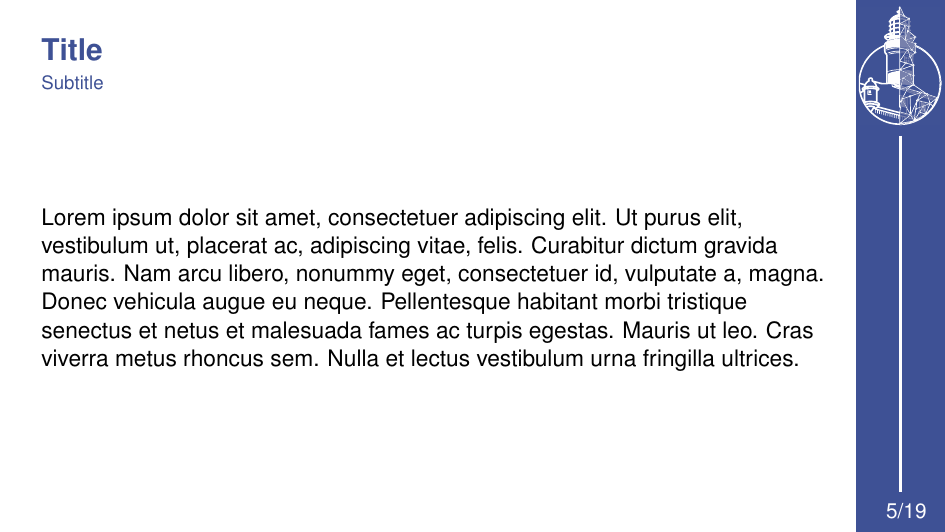
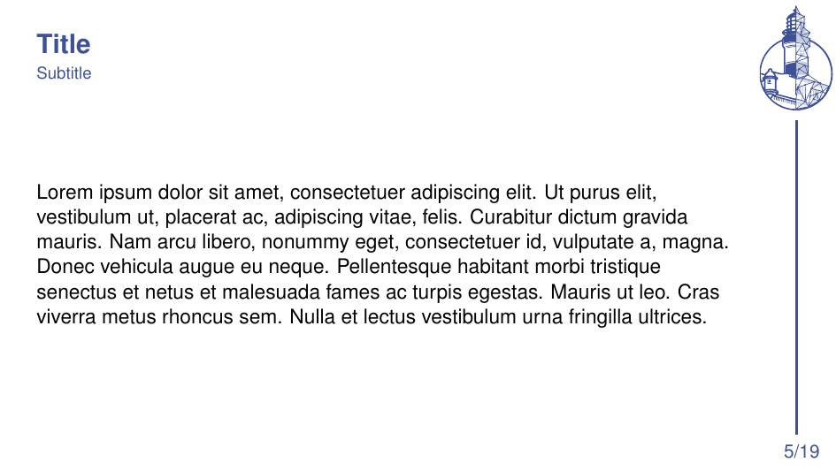
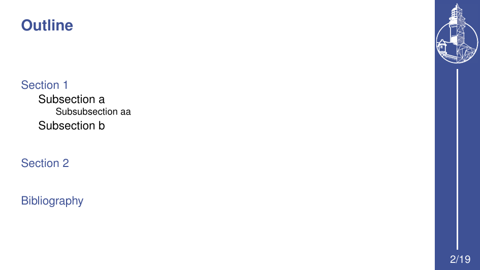
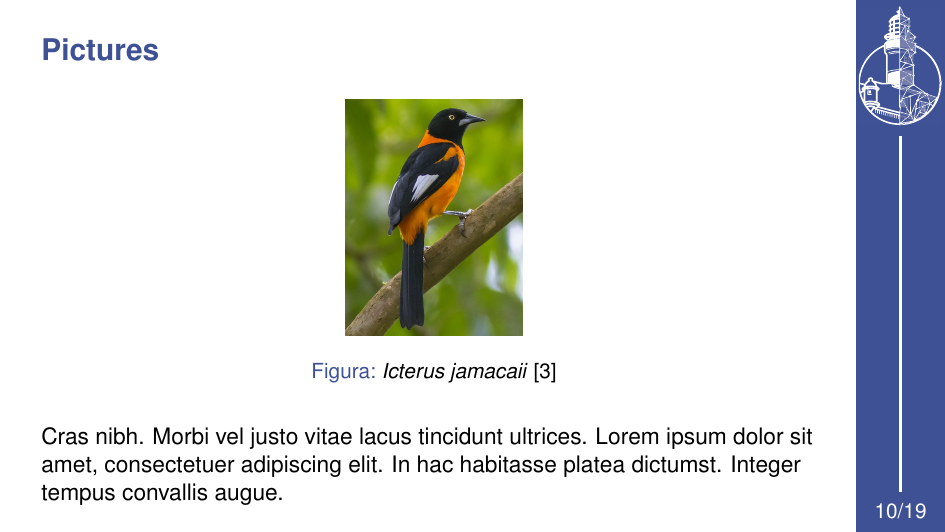
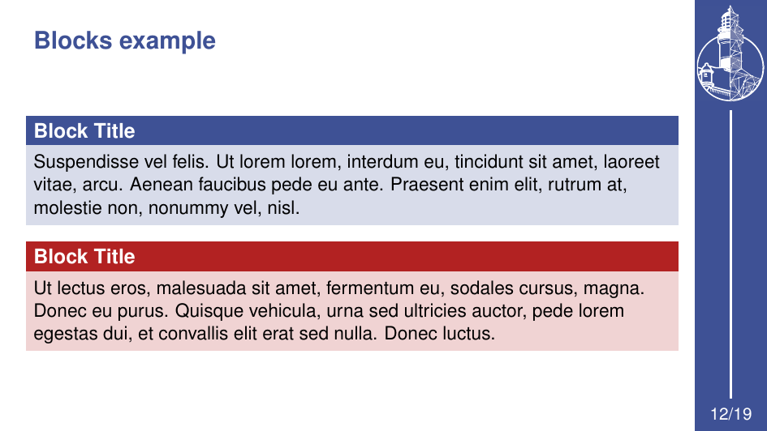

# LabIA Beamer Template

Tema [Beamer](https://ctan.org/pkg/beamer) com a identidade visual do **LabIA**.

---

## Sumário

- [Como usar](#como-usar)
  - [No Overleaf](#no-overleaf)
  - [Uso local](#uso-local)
- [Proporção do documento (16:9)](#proporção-do-documento-169)
- [Opções do tema](#opções-do-tema)
- [Cabeçalhos de seção](#cabeçalhos-de-seção)
- [Compilação](#compilação)
- [Documento de exemplo](#documento-de-exemplo)
- [Capturas de tela](#capturas-de-tela)

---

## Como usar

Para usar o tema, basta colocar os arquivos dele na mesma pasta em que está o seu documento `.tex` e carregá-lo com `\usetheme{LabIA}`. Os arquivos necessários são:

| Arquivo | Descrição |
| --- | --- |
| `beamerthemeLabIA.sty` | O tema em si (todas as definições visuais) |
| `logo.pdf` | Logo do LabIA usado na barra lateral (tema padrão) |
| `logo_white.pdf` | Logo usado na variante clara (opção `white`) |

Veja abaixo um exemplo de uso do template no seu documento:

```latex
\documentclass[aspectratio=169]{beamer}

\usetheme{LabIA}

\title{Minha apresentação}
\author{Seu Nome}
\institute{Universidade Federal da Bahia - UFBA}
\date{\today}

\begin{document}

\begin{frame}
    \titlepage
\end{frame}

\end{document}
```

> **⚠️ Aviso:** É fortemente recomendado utilizar
> ```latex
> \documentclass[aspectratio=169]{beamer}
> ```
> em seu documento, pois o template foi desenhado pensando na proporção 16:9. Assim, o conteúdo da sua apresentação aproveita melhor o template, além de também estar adaptado às telas modernas. 
>
> Por mais que tenha sido desenhado para 16:9, o template também funciona bem com a proporção padrão do beamer (4:3).

### No Overleaf

1. Crie um novo projeto em [overleaf.com](https://www.overleaf.com) (*New Project* → *Blank Project* ou importe o repositório via GitHub);
2. Faça o upload de `beamerthemeLabIA.sty`, `logo.pdf`, `logo_white.pdf` e do seu documento `.tex` para a raiz do projeto;
3. Clique em *Recompile*.

> Se preferir começar do zero, você também pode **fazer uma cópia** do template já no Overleaf e usá-la como ponto de partida — sem precisar subir os arquivos manualmente. [Clique aqui para acessar o template](https://pt.overleaf.com/read/bgffkxtjrcjd#258378) e, em seguida, clique em "Menu" → "Make a copy".

### Uso local

1. Copie `beamerthemeLabIA.sty`, `logo.pdf` e `logo_white.pdf` para a pasta do seu documento;
2. Crie o seu documento `.tex` como o preâmbulo acima e compile-o (veja [Compilação](#compilação)).


---

## Opções do tema

As opções são passadas entre colchetes em `\usetheme`:

```latex
% Exemplo
\usetheme[titlepagenumber,nopagenumber,white]{LabIA}
```

| Opção | Efeito |
| --- | --- |
| `titlepagenumber` | Exibe a numeração de página também no slide de título (padrão: **desativada**) |
| `nopagenumber` | Remove a numeração de página de todos os slides (padrão: **ativada** — as páginas são numeradas) |
| `white` | Usa a variante clara: barra lateral e fundo dos slides de título/seção em branco (padrão: **desativada** — fundo azul) |

---

## Cabeçalhos de seção

Para criar um slide de seção com o layout padronizado do tema (fundo colorido, título centralizado), use o comando **`\framesection`**, definido pelo próprio tema. Ele aceita um título e um subtítulo opcionais:

| Uso | Resultado |
| --- | --- |
| `\framesection` | Usa o título da seção atual, definido com `\section{...}` |
| `\framesection{Título}` | Título personalizado |
| `\framesection{}{Subtítulo}` | Título da seção atual + subtítulo |
| `\framesection{Título}{Subtítulo}` | Título e subtítulo personalizados |

Imagens do cabeçalho de seção podem ser vistas em [Capturas de tela](#capturas-de-tela) e no [documento de exemplo](#documento-de-exemplo).

---

## Compilação

O tema funciona com qualquer motor LaTeX (`pdflatex`, `xelatex` ou `lualatex`), sem configuração adicional. Com bibliografia (BibTeX), a sequência completa é `pdflatex → bibtex → pdflatex → pdflatex`. Usando `latexmk`, a sequência é resolvida automaticamente:

```bash
latexmk -pdf main.tex
```

ou manualmente:

```bash
pdflatex main.tex
bibtex main
pdflatex main.tex
pdflatex main.tex
```

---

## Documento de exemplo

O arquivo [`example.tex`](example.tex) demonstra todos os recursos do tema em um único documento: página de título, sumário (`\tableofcontents`), siglas, cabeçalhos de seção, listas, colunas com citações, figuras, tabelas, blocos, fórmulas, código e referências bibliográficas.

O PDF compilado, [`example.pdf`](example.pdf), pode ser usado como referência visual. As capturas de tela a seguir foram obtidas a partir do documento de exemplo.

---

## Capturas de tela

| Página de título | Página de título (white) |
| --- | --- |
|  |  |

| Slide de conteúdo | Slide de conteúdo (white) |
| --- | --- |
|  |  |

| Cabeçalho de seção | Sumário |
| --- | --- |
|  |  |

| Figura e legenda | Blocos |
| --- | --- |
|  |  |

---